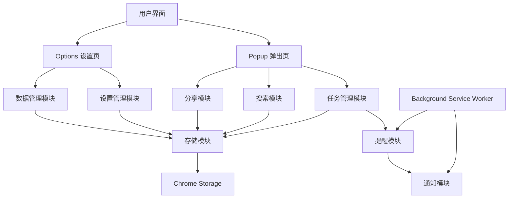

# TaskMaster 扩展项目 Wiki

## 1. 项目概述

TaskMaster 是一个智能待办事项管理 Chrome 扩展，帮助用户高效管理日常任务，提供任务分类、提醒、搜索、分享等功能。

**主要功能**：
- 任务管理（添加、删除、完成）
- 任务分类（置顶、按日期分组、归档）
- 搜索与过滤
- 任务备注
- 任务分享
- 提醒通知
- 数据导入/导出
- 数据加密
- 个性化设置

## 2. 项目架构

TaskMaster 采用标准的 Chrome 扩展架构，由以下几个核心模块组成：



**模块说明**：
- **Popup 弹出页**：用户主要交互界面，用于任务的日常管理
- **Options 设置页**：用户个性化设置和数据管理界面
- **Background Service Worker**：后台运行，处理提醒和通知
- **存储模块**：负责数据的存储和读取，使用 Chrome Storage API
- **任务管理模块**：处理任务的CRUD操作
- **搜索模块**：提供任务搜索和过滤功能
- **分享模块**：支持任务清单的分享
- **提醒模块**：基于 Chrome Alarms API 实现任务提醒
- **通知模块**：基于 Chrome Notifications API 实现桌面通知
- **设置管理模块**：处理用户设置的保存和应用
- **数据管理模块**：处理数据的导入/导出/清空

## 3. 目录结构

```
├── icons/                 # 扩展图标
│   ├── icon128.png        # 128x128 图标
│   ├── icon48.png         # 48x48 图标
│   └── icon16.png         # 16x16 图标
├── background.js          # 后台服务工作器
├── manifest.json          # 扩展配置文件
├── options.html           # 设置页面
├── options.js             # 设置页面逻辑
├── popup.html             # 弹出页面
├── popup.js               # 弹出页面逻辑
├── popup.css              # 弹出页面样式
└── package.json           # 项目依赖配置
```

**文件说明**：
- **manifest.json**：扩展的核心配置文件，定义了扩展的名称、版本、权限等信息
- **background.js**：后台服务工作器，处理提醒和通知
- **popup.html/popup.js/popup.css**：弹出页面的结构、逻辑和样式
- **options.html/options.js**：设置页面的结构和逻辑
- **icons/**：存放扩展的图标文件

## 4. 核心模块详解

### 4.1 任务管理模块

**功能**：处理任务的添加、删除、完成等操作

**关键函数**：
- `renderTasks()`：渲染任务列表，包括置顶任务、按日期分组的活动任务和归档任务
- `generateTaskItemHtml(task)`：生成单个任务项的HTML
- `saveNotes(taskId)`：保存任务备注

**数据结构**：
```javascript
// 任务对象结构
{
  id: Number,           // 任务ID（时间戳）
  text: String,         // 任务内容
  completed: Boolean,   // 完成状态
  createdAt: String,    // 创建时间（ISO格式）
  due: String,          // 截止时间（ISO格式）
  completedTime: Number, // 完成时间（时间戳）
  pinned: Boolean,      // 是否置顶
  notes: String         // 任务备注
}
```

### 4.2 搜索模块

**功能**：提供任务搜索和过滤功能

**关键函数**：
- `performSearch()`：执行搜索操作
- `filterTasks(tasks)`：根据搜索条件过滤任务
- `renderSearchResults(tasks)`：渲染搜索结果
- `highlightSearchText(text, query)`：高亮搜索文本

**搜索状态**：
```javascript
// 搜索状态对象
{
  query: String,        // 搜索关键词
  showActive: Boolean,  // 是否显示活动任务
  showCompleted: Boolean, // 是否显示已完成任务
  showNotesOnly: Boolean, // 是否只显示有备注的任务
  isSearching: Boolean   // 是否正在搜索
}
```

### 4.3 分享模块

**功能**：支持任务清单的分享

**关键函数**：
- `showShareMenu(content)`：显示分享选项菜单
- `copyToClipboard(text)`：复制文本到剪贴板

**分享方式**：
- 复制到剪贴板
- 邮件分享
- 系统分享（Web Share API）

### 4.4 提醒模块

**功能**：基于 Chrome Alarms API 实现任务提醒

**关键函数**：
- `chrome.alarms.onAlarm.addListener()`：监听闹钟触发事件
- `chrome.alarms.create()`：创建任务提醒闹钟

### 4.5 通知模块

**功能**：基于 Chrome Notifications API 实现桌面通知

**关键函数**：
- `chrome.notifications.create()`：创建桌面通知
- `chrome.runtime.onMessage.addListener()`：监听来自popup的消息，创建任务添加通知

### 4.6 设置管理模块

**功能**：处理用户设置的保存和应用

**关键函数**：
- `loadSettings()`：加载设置
- `saveSettings()`：保存设置
- `resetSettings()`：重置设置为默认值

**默认设置**：
```javascript
const DEFAULT_SETTINGS = {
  // 安全设置
  enableEncryption: false,
  encryptionKey: '',
  
  // 显示设置
  showCompletedTasks: true,
  autoExpandToday: true,
  showTaskStats: true,
  
  // 行为设置
  confirmDelete: true,
  autoSaveNotes: true,
  taskRetentionDays: 90,
  
  // 提醒设置
  enableNotifications: true,
  soundNotifications: false
};
```

### 4.7 数据管理模块

**功能**：处理数据的导入/导出/清空

**关键函数**：
- `exportData()`：导出任务数据
- `importData()`：导入任务数据
- `clearAllData()`：清空所有数据
- `updateDataStats()`：更新数据统计信息

**数据导出格式**：
```javascript
{
  tasks: Array,         // 任务数组
  exportDate: String,   // 导出日期（ISO格式）
  version: String       // 扩展版本
}
```

### 4.8 安全模块

**功能**：提供数据加密功能

**关键函数**：
- `simpleEncrypt(text, key)`：简单加密函数
- `simpleDecrypt(encryptedText, key)`：简单解密函数
- `encryptAllTasks(key)`：加密所有任务数据

## 5. 关键 API 使用

### 5.1 Chrome Storage API

**用途**：存储任务数据和用户设置

**使用方式**：
- `chrome.storage.sync.get()`：读取数据
- `chrome.storage.sync.set()`：保存数据
- `chrome.storage.onChanged.addListener()`：监听数据变化

### 5.2 Chrome Alarms API

**用途**：创建和管理任务提醒闹钟

**使用方式**：
- `chrome.alarms.create()`：创建闹钟
- `chrome.alarms.onAlarm.addListener()`：监听闹钟触发事件

### 5.3 Chrome Notifications API

**用途**：显示桌面通知

**使用方式**：
- `chrome.notifications.create()`：创建通知

### 5.4 Chrome Runtime API

**用途**：处理扩展运行时的消息传递

**使用方式**：
- `chrome.runtime.onMessage.addListener()`：监听消息
- `chrome.runtime.sendMessage()`：发送消息
- `chrome.runtime.openOptionsPage()`：打开选项页面
- `chrome.runtime.getURL()`：获取扩展资源URL
- `chrome.runtime.onInstalled.addListener()`：监听扩展安装事件

## 6. 项目运行方式

### 6.1 本地开发

1. **克隆项目**：将项目代码克隆到本地
2. **打开Chrome扩展管理页面**：在Chrome地址栏输入 `chrome://extensions`
3. **启用开发者模式**：在扩展管理页面右上角开启开发者模式
4. **加载已解压的扩展**：点击"加载已解压的扩展程序"按钮，选择项目目录
5. **测试扩展**：点击Chrome工具栏中的TaskMaster图标，开始使用

### 6.2 构建与发布

1. **打包扩展**：在扩展管理页面点击"打包扩展程序"按钮，选择项目目录
2. **生成CRX文件**：系统会生成.crx和.pem文件
3. **发布到Chrome Web Store**：登录Chrome Web Store开发者控制台，上传扩展

## 7. 核心功能流程

### 7.1 添加任务流程

1. 用户在popup页面输入任务内容
2. 点击提交按钮
3. 创建新任务对象，包含id、text、completed等属性
4. 从Chrome Storage读取现有任务
5. 将新任务添加到任务数组
6. 将更新后的任务数组保存到Chrome Storage
7. 创建任务提醒闹钟（如果设置了提醒）
8. 发送任务添加通知
9. 重新渲染任务列表

### 7.2 完成任务流程

1. 用户点击任务旁边的复选框
2. 获取任务ID
3. 从Chrome Storage读取现有任务
4. 找到对应任务，更新completed状态为true，添加completedTime
5. 如果任务已置顶，取消置顶
6. 将更新后的任务数组保存到Chrome Storage
7. 重新渲染任务列表

### 7.3 搜索任务流程

1. 用户在搜索框输入关键词
2. 选择搜索过滤条件
3. 执行搜索操作，过滤任务
4. 渲染搜索结果，显示匹配的任务
5. 在搜索结果中高亮显示匹配的文本

### 7.4 导出数据流程

1. 用户在设置页面点击"导出任务数据"按钮
2. 从Chrome Storage读取任务和设置数据
3. 如果数据已加密，先解密
4. 生成包含任务数据、导出日期和版本的JSON对象
5. 将JSON对象转换为Blob
6. 创建下载链接，触发文件下载

### 7.5 导入数据流程

1. 用户在设置页面点击"导入任务数据"按钮
2. 打开文件选择对话框，选择JSON文件
3. 读取并解析JSON文件
4. 验证数据格式
5. 如果当前启用了加密，对导入的数据进行加密
6. 将导入的任务保存到Chrome Storage
7. 更新数据统计信息

## 8. 依赖关系

| 依赖项 | 用途 | 来源 |
|--------|------|------|
| Chrome Storage API | 数据存储 | Chrome扩展API |
| Chrome Alarms API | 任务提醒 | Chrome扩展API |
| Chrome Notifications API | 桌面通知 | Chrome扩展API |
| Chrome Runtime API | 消息传递和扩展管理 | Chrome扩展API |
| Web Share API | 系统分享功能 | 浏览器API |
| Clipboard API | 复制到剪贴板 | 浏览器API |

## 9. 性能优化

1. **批量操作**：在修改多个任务时，使用批量操作减少Chrome Storage的读写次数
2. **事件委托**：使用事件委托减少事件监听器的数量
3. **防抖处理**：对搜索输入等频繁操作进行防抖处理
4. **惰性加载**：只在需要时渲染任务列表
5. **缓存机制**：缓存DOM元素引用，减少DOM查询

## 10. 安全考虑

1. **数据加密**：提供可选的数据加密功能，保护用户任务数据
2. **XSS防护**：使用`escapeHtml()`函数防止XSS攻击
3. **权限管理**：只请求必要的权限（storage, alarms, notifications）
4. **输入验证**：对用户输入进行验证，特别是加密密钥的长度验证
5. **错误处理**：妥善处理Chrome API调用的错误，避免扩展崩溃

## 11. 未来扩展方向

1. **云同步**：支持任务数据的云同步，跨设备访问
2. **任务分类**：增加任务分类标签功能
3. **任务优先级**：支持任务优先级设置
4. **重复任务**：支持重复任务的创建和管理
5. **任务协作**：支持多用户任务协作
6. **数据备份**：自动备份任务数据到云端
7. **主题定制**：支持扩展主题的自定义
8. **键盘快捷键**：增加键盘快捷键支持

## 12. 故障排除

### 12.1 常见问题

| 问题 | 可能原因 | 解决方案 |
|------|----------|----------|
| 任务不保存 | Chrome Storage空间不足 | 清空部分任务或增加存储配额 |
| 提醒不显示 | 通知权限被拒绝 | 在浏览器设置中允许通知 |
| 搜索无结果 | 搜索条件过于严格 | 调整搜索过滤条件 |
| 数据导入失败 | 数据格式错误 | 确保导入的是有效的JSON文件 |
| 加密功能失效 | 密钥错误 | 确保输入正确的加密密钥 |

### 12.2 调试方法

1. **查看控制台日志**：在popup页面右键选择"检查"，查看控制台输出
2. **检查Chrome扩展管理页面**：查看扩展是否正常加载
3. **检查权限**：确保扩展已获得必要的权限
4. **查看存储数据**：在Chrome开发者工具的Application标签页查看Chrome Storage中的数据

## 13. 代码规范

1. **命名规范**：使用驼峰命名法
2. **注释规范**：关键函数和复杂逻辑添加注释
3. **错误处理**：妥善处理API调用错误
4. **代码风格**：保持一致的代码缩进和格式
5. **安全规范**：避免使用不安全的DOM操作，防止XSS攻击

## 14. 版本历史

| 版本 | 日期 | 主要变更 |
|------|------|----------|
| 2.9.0 | 2025-07-29 | 增加搜索功能，优化任务管理，添加数据加密 |
| 2.8.0 | 2025-06-30 | 增加任务分享功能，优化提醒系统 |
| 2.7.0 | 2025-05-15 | 增加任务备注功能，优化UI界面 |
| 2.6.0 | 2025-04-01 | 增加数据导入/导出功能 |
| 2.5.0 | 2025-03-01 | 增加任务置顶功能，优化任务分组 |
| 2.0.0 | 2025-01-01 | 重构代码，升级到Manifest V3 |

## 15. 总结

TaskMaster 是一个功能丰富、用户友好的待办事项管理Chrome扩展，通过合理的架构设计和Chrome API的充分利用，为用户提供了高效的任务管理体验。项目采用模块化设计，代码结构清晰，易于维护和扩展。

**核心优势**：
- 直观的用户界面
- 强大的任务管理功能
- 灵活的搜索和过滤
- 可靠的提醒系统
- 安全的数据管理
- 丰富的个性化设置

TaskMaster 不仅满足了用户的基本任务管理需求，还通过不断的功能迭代和性能优化，为用户提供了更加智能、高效的任务管理体验。