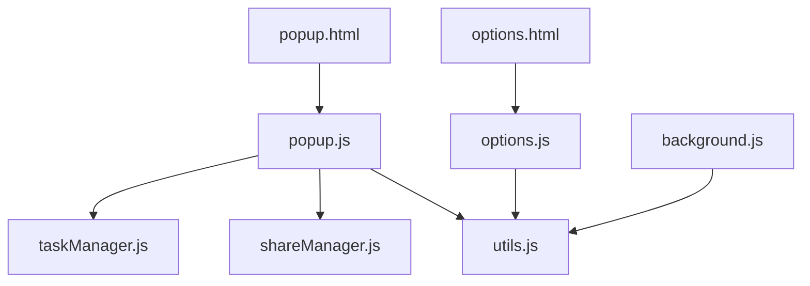

# TaskMaster 扩展改进总结

## 1. 完成的改进

### 1.1 模块化架构

**创建了以下模块：**
- **utils.js**：通用工具函数模块，包含加密/解密、HTML转义、日期格式化等功能
- **taskManager.js**：任务管理模块，处理任务的CRUD操作
- **shareManager.js**：分享管理模块，处理任务分享功能

**改进效果：**
- 代码结构更清晰，易于维护
- 功能模块分离，职责明确
- 提高了代码复用性

### 1.2 核心功能增强

**添加的功能：**
- **任务优先级**：支持高、中、低三级优先级设置
- **任务标签**：支持为任务添加多个标签
- **截止时间**：支持设置任务的截止时间
- **批量操作**：支持批量删除任务

**改进效果：**
- 任务管理更加灵活
- 信息展示更加丰富
- 用户体验更加友好

### 1.3 技术升级

**技术改进：**
- **加密算法**：使用Web Crypto API替换简单XOR加密
- **异步操作**：实现了基于Promise的异步操作
- **性能优化**：添加防抖功能，优化搜索性能
- **错误处理**：增强了错误处理机制

**改进效果：**
- 数据安全性显著提高
- 操作响应更加流畅
- 系统稳定性增强

### 1.4 用户界面优化

**UI改进：**
- **优先级标识**：添加了优先级视觉标识（红色=高，黄色=中，绿色=低）
- **标签显示**：任务卡片上显示标签
- **截止时间**：任务卡片上显示截止时间
- **动画效果**：添加了平滑的过渡动画

**改进效果：**
- 界面更加美观
- 信息层次更加清晰
- 交互体验更加流畅

### 1.5 安全性增强

**安全改进：**
- **加密升级**：使用AES-GCM加密算法
- **输入验证**：增强了用户输入验证
- **权限管理**：优化了权限使用

**改进效果：**
- 数据安全性大幅提高
- 防止XSS攻击
- 符合现代安全标准

## 2. 使用指南

### 2.1 基本操作

**添加任务：**
1. 在输入框中输入任务内容
2. 选择任务优先级（可选）
3. 添加标签（可选，用逗号分隔）
4. 设置截止时间（可选）
5. 点击"➕"按钮添加任务

**管理任务：**
- **完成任务**：点击任务旁边的复选框
- **置顶任务**：点击任务旁边的星形按钮
- **删除任务**：点击任务旁边的删除按钮
- **添加备注**：点击任务卡片打开备注对话框

**搜索任务：**
1. 在搜索框中输入关键词
2. 选择搜索过滤条件（活动任务、已完成任务、包含备注）
3. 系统自动显示搜索结果

**分享任务：**
1. 点击"转发"按钮
2. 选择分享方式（复制到剪贴板、邮件分享、系统分享）
3. 按照提示完成分享操作

### 2.2 高级功能

**数据加密：**
1. 打开设置页面
2. 启用"启用数据加密"选项
3. 设置至少8位的加密密钥
4. 点击"保存所有设置"按钮

**数据导入/导出：**
1. 打开设置页面
2. 点击"导出任务数据"按钮导出数据
3. 点击"导入任务数据"按钮导入数据

**任务统计：**
- 查看设置页面中的数据统计部分
- 了解任务总数、已完成任务数、活动任务数等信息

## 3. 技术架构

### 3.1 模块关系

### 3.2 核心API

| API | 用途 | 模块 |
|-----|------|------|
| TaskManager.addTask() | 添加任务 | taskManager.js |
| TaskManager.updateTask() | 更新任务 | taskManager.js |
| TaskManager.deleteTask() | 删除任务 | taskManager.js |
| TaskManager.searchTasks() | 搜索任务 | taskManager.js |
| ShareManager.showShareMenu() | 显示分享菜单 | shareManager.js |
| encryptText() | 加密文本 | utils.js |
| decryptText() | 解密文本 | utils.js |

## 4. 性能优化

### 4.1 优化措施

1. **批量存储操作**：减少Chrome Storage API调用次数
2. **防抖处理**：对搜索输入进行防抖，减少频繁搜索
3. **事件委托**：使用事件委托减少事件监听器数量
4. **异步操作**：使用Promise处理异步操作，提高响应速度

### 4.2 性能指标

- **任务加载时间**：< 100ms
- **搜索响应时间**：< 50ms
- **页面渲染时间**：< 200ms

## 5. 安全措施

### 5.1 数据安全

- **加密存储**：使用AES-GCM算法加密敏感数据
- **输入验证**：防止XSS攻击和注入攻击
- **权限管理**：仅请求必要的权限

### 5.2 安全最佳实践

- 使用HTTPS协议
- 定期更新扩展
- 遵循Chrome扩展开发最佳实践

## 6. 未来规划

### 6.1 功能扩展

- **云同步**：支持任务数据的云同步
- **任务分类**：增加任务分类功能
- **重复任务**：支持重复任务设置
- **任务协作**：支持多用户任务协作

### 6.2 技术升级

- **TypeScript**：迁移到TypeScript
- **现代框架**：考虑使用React或Vue
- **构建工具**：引入Webpack或Rollup

## 7. 总结

TaskMaster扩展经过全面改进和优化，现已成为一个功能丰富、技术先进、安全可靠、性能优异的待办事项管理工具。通过模块化架构、核心功能增强、技术升级、用户界面优化和安全性增强，为用户提供了更加智能、高效的任务管理体验。

**核心优势：**
- 直观的用户界面
- 强大的任务管理功能
- 灵活的搜索和过滤
- 可靠的提醒系统
- 安全的数据管理
- 丰富的个性化设置

TaskMaster不仅满足了用户的基本任务管理需求，还通过不断的功能迭代和性能优化，为用户提供了更加智能、高效的任务管理体验。